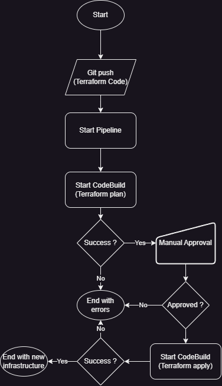
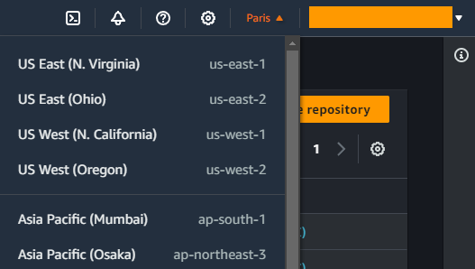
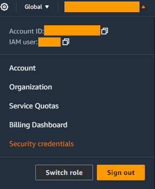
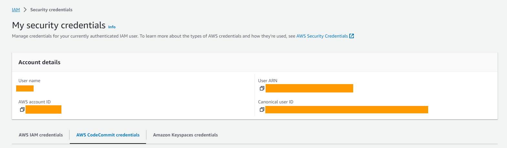
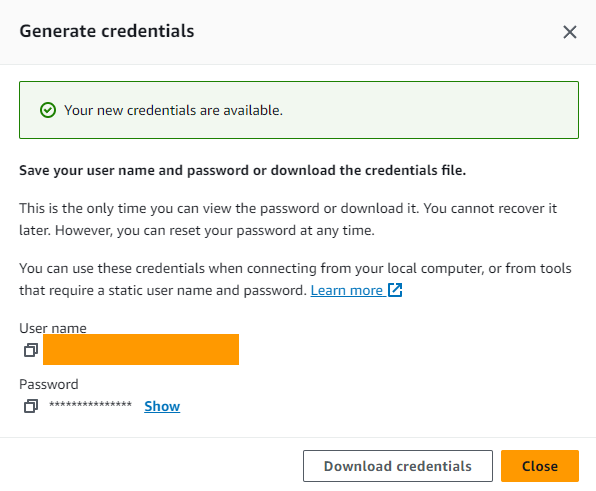
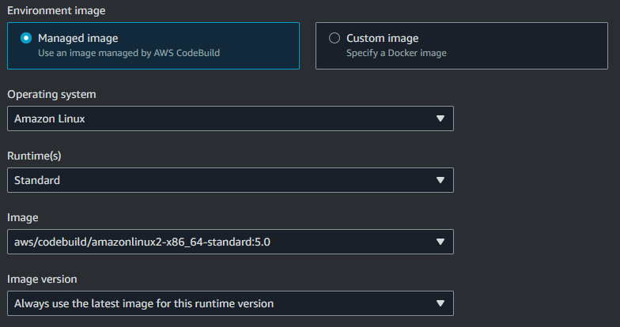
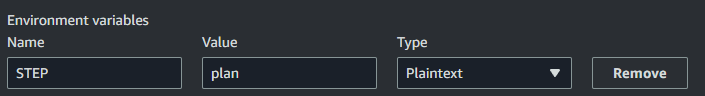
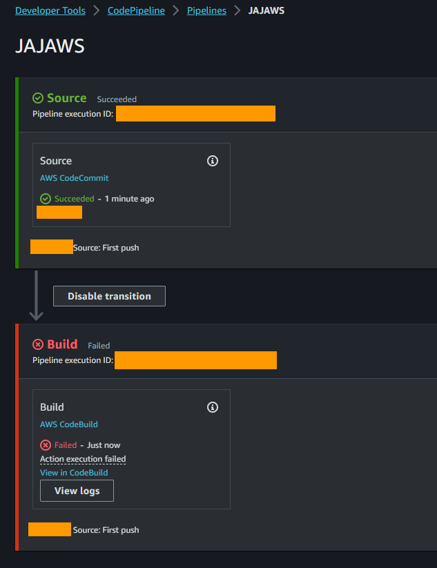
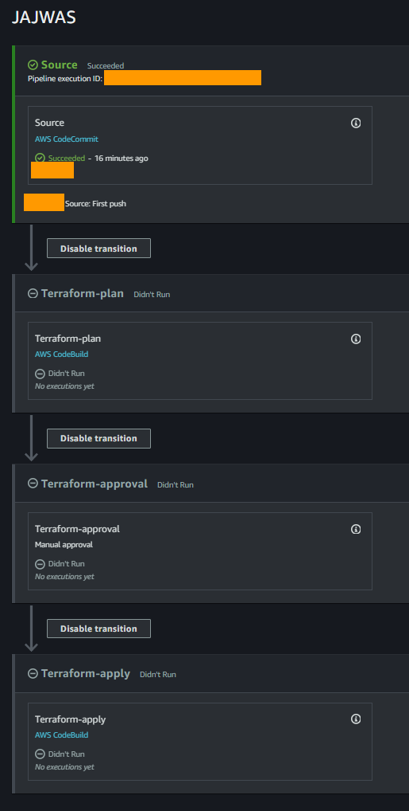
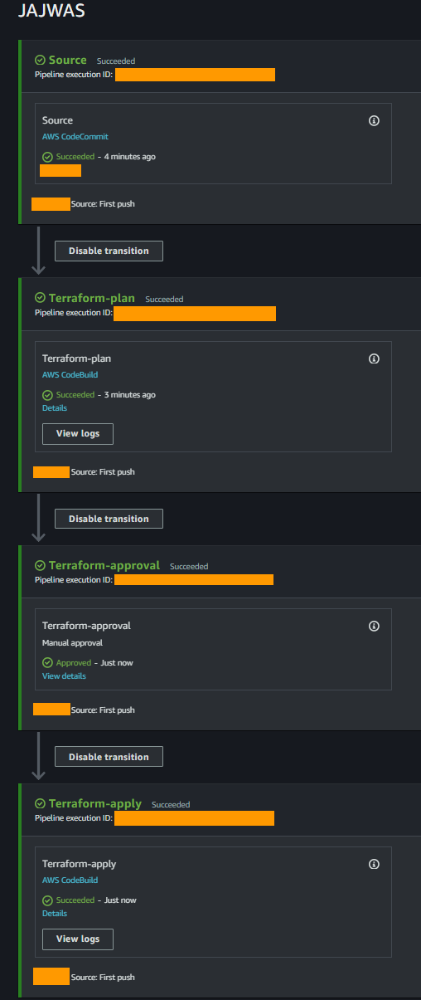

# Recommended Infrastructure

## Technologies

- S3 Bucket
- CodeBuild
- CodePipeline
- CodeCommit

## Visualization of the Concept



## Description of the section

In this section, we will set up the basic infrastructure for Terraform deployments with a pipeline. By the end of this section, we will have a solution capable of deploying Terraform-coded infrastructure from a CodeCommit repository.

For this, we will use those three deployments Terraform stages:

- `terraform init`: Initializes the Terraform project and its configurations.
- `terraform plan`: Gives you the information on (without creating) what will be created, deleted, or modified in the infrastructure.
- `terraform apply`: Start the creation, deletion, or modification of the infrastructure.

In order for Terraform to operate properly, it requires files that indicate deployments have been made. An S3 bucket will be used for this management, and it will be populated automatically by the end of this section.

## S3 Bucket

This S3 bucket will be used to store the changes made by Terraform. In AWS, you can simply navigate to the 'S3' menu and select 'Create Bucket'. A form will allow you to create the bucket, which can be filled out as follows:

- Bucket name: Please note that bucket names are unique across ALL of AWS, not just within your account. Therefore, you can choose a random name as it is primarily used for backend operations. It is also recommended to name your S3 buckets in this way: name-bucket-XXXXX, where X is a number.
- AWS Region: I recommend selecting the region where your end users will be located.
- Object Ownership: Select `ACLs disabled`.
- Block Public Access: Select `Block all public access`.
- Bucket Versioning: Select `Disable` (If you want to maintain a history of your Terraform states, you can enable it. However, I believe that the commit history in CodeCommit is sufficient.).
- Tags: You can add tags if you want.
- Default encryption: I recommend `SSE-S3` with `Bucket Key` enabled.

You can now create your bucket.

## CodeCommit

### Creation of the CodeCommit

This CodeCommit repository will contain the entire Terraform infrastructure. It is the basis for our CodePipeline.

⚠️❗ **Important Information** : CodeCommit, unlike S3, is not a `Global` service. Therefore, before creating your repository, make sure to check the region at the top right of the screen and select the desired one (likely the same as the S3 bucket).



To do this, it's as simple as going to the 'CodeCommit' menu and clicking on 'Create repository'. Once in the menu, it's quite straightforward: provide a name, a description, and tags if necessary.

### Cloning the CodeCommit Repository

You'll need to get your `HTTPS Git credentials` for this part. You can find `Security Credentials` by clicking on the menu at the top right (where your account name is).



Once in the user's configuration menu, simply go to the `AWS CodeCommit credentials` tab.



Now you can click on 'Generate credentials' at the bottom. This will generate credentials that can be used with CodeCommit. Once generated, you should see the following window. It's important to keep these credentials for cloning the repository.



Once you have obtained the credentials, you can perform a git clone with the URL of your repository, which should be in the following format:

`git clone https://git-codecommit.REGION.amazonaws.com/v1/repos/REPO_NAME`

After cloning the CodeCommit repository, create a file, such as `README.md`. It is necessary for the main branch (e.g., `master`) to be available for the next steps.

## CodeBuild

As shown in the flowchart, we will need CodeBuild. To put it very simply, a CodeBuild is a server that will start, perform a task, and then stop (again, this is a very simplistic view). In our case, we will need two CodeBuild instances to execute the `terraform plan` and `terraform apply` commands.

⚠️❗ **Important Information**: Codebuild, unlike S3, is not a `Global` service. Therefore, before creating your CodeBuild, make sure to check the region at the top right of the screen and select the desired one (likely the same as the S3 bucket).

### CodeBuild Configuration

In AWS, you can search for the 'CodeBuild' service in the search bar. Then click on 'Create build project'. A form will allow you to create the CodeBuild, which can be filled out as follows:

- Project name: For the name, I recommend this format (it is not a standard, but from experience it helps to keep things orderly): `projectname-terraform-STATE` where `STATE` is `plan` or `apply`.
- Source: Here, you should select the previously created CodeCommit and the main branch (e.g., `master`). This will allow CodeBuild to know which repository to clone in order to execute the commands we will provide.
- Environnement: Here, I recommend keeping it simple with standard 'Managed images', such as (check for the last version): 
- Privileged: In our case, it's not necessary.
- Service Role: My recommendation is to keep the default name and make a note of it. We will need it later.
- Additional configurations: You can leave everything else as default except the environment variables. These are the environment variables that we will use for the selection of the Terraform step. You can use any variable name you like here, but make a note of it for later. Additionally, the value of this variable will determine whether the `plan' or `apply' command is executed. You may need to adjust the value of this variable depending on your CodeBuild:
- Buildspec: In the configuration presented here, it's important to leave this option as default. This file will contain the commands executed by CodeBuild and will be stored in CodeCommit.

Now you can click on 'Create build project'. Repeat the process to create the other Terraform step (either `plan` or `apply`).

### CodeBuild Permissions

⚠️❗ **Important Information**: Since this Git repository is intended to showcase various AWS services in Terraform, I will grant administrator permission to my CodeBuild. Of course, depending on your needs, you can adjust them according to the deployed infrastructure.

Since we will be deploying our infrastructure via CodeBuild, it should have the ability to create and read all elements of this infrastructure. To achieve this, we will modify its IAM (Identity and Access Management) role. In the search bar, you can look for 'IAM' and then click on the number of available roles. A list of roles should then appear. In the list of roles, look for the ones related to the previously created CodeBuild instances, which should have this format if left as default: `codebuild-PROJECTNAME-terraform-STATE-service-role`.

Click on one of the two, then 'Add permissions' > 'Attach policies'. Once this is done, a list of policies should appear. The one we are interested in is `AdministratorAccess` (or another depends on your case). Select it and click on `Add permissions` at the bottom of the page. You should now see the new permission in the role. Simply repeat the process for the other role.

## CodePipeline

It's time to bring all these elements together and set them up in a pipeline before making our first `git push`.

⚠️❗ **Important Information**: CodePipeline, unlike S3, is not a `Global` service. Therefore, before creating your CodePipeline, make sure to check the region at the top right of the screen and select the desired one (likely the same as the S3 bucket).

### Creation of the CodePipeline

In AWS, you can search for the 'CodePipeline' service in the search bar, and then click on 'Create pipeline'. A form will allow you to create the CodePipeline, which can be filled out as follows:

- Pipeline name: You can use your project name, for example.
- Role name: let the default one with the checkbox.
- Source: As with CodeBuild, we will choose the CodeCommit we created. For the detection, I strongly recommend selecting `Amazon CloudWatch Events`. For the output just keep `CodePipeline default`.
- Add build stage: here, select your CodeBuild for `plan`.
- Add deploy stage: just skip this part.

You can now click on 'Create pipeline'.

At this moment, you should see something like this (with an error, which is normal because our CodeBuild can't find its instructions file):



### CodePipeline Configuration

It's time to customize our CodePipeline to have all our stages. When you click on 'Edit,' you can see that it's possible to edit the stages or add new ones. Below 'Source,' click on 'Add stage' and name it, for example, 'Terraform-plan' (I will start with the plan because we are below the 'Source' stage). Now, you can add an action by clicking on 'Add.' A form will then appear:

- Action name: it could be 'Terraform-plan'.
- Action provider: `AWS CodeBuild`.
- Input artifacts: `SourceArtifact`.
- Project name: choose the CodeBuild for `plan`.

You can now click on 'Done' and again 'Done'. You should now see 3 stages.

Because our terraform plan may sometimes indicate unnecessary additions or deletions, we will add a manual approval step. This will block the pipeline until someone clicks the 'Review' button. Under our 'Terraform-plan' stage, click on 'Add stage,' and name it 'Terraform-approval,' for example. Now, you can add an action by clicking on 'Add'. A form will then appear:

- Action name: it could be 'Terraform-approval'.
- Action provider: `Manual approval`.

You can now click on 'Done' and again 'Done'. You should now see 4 stages.

Because we want to standardize everything, we will remove the last stage to rename it. On the last stage, which should be named 'Build,' click 'Edit,' then 'Delete'. Below 'Terraform-approval,' you can now add a new stage that will be a copy of 'Terraform-plan,' but for 'Terraform-apply' (you can repeat the 'plan' procedure, but rename it as 'apply').

If you have followed the procedure, you should have a CodePipeline like this:



## The First Push

It's now time to finalize our solution by creating the minimum files for Terraform deployment. To do that, navigate to the directory of your CodeCommit that you cloned earlier.

To start, it's necessary to create a 'buildspec.yaml' file at the root of your CodeCommit (it must remain there). I recommend then creating an 'infrastructure' folder in which we will place a 'provider.tf' file. The structure should look like this:

- CodeCommit/
  - buildspec.yaml
  - infrastructure/
    - provider.tf

### Buildspec

The 'buildspec' file is the instruction file for our CodeBuild. Essentially, it consists of bash commands that will be executed one after the other. Here's an example:

```
version: 0.2

phases:
  install:
    commands:
      - "wget https://releases.hashicorp.com/terraform/X.X.X/terraform_X.X.X_linux_amd64.zip"
      - "unzip terraform_X.X.X_linux_amd64.zip"
      - "mv terraform /usr/local/bin/"
  pre_build:
    commands:
      - cd infrastructure
      - terraform init
  build:
    commands:
      - |
          if [ "$STEP" = "plan" ]; then
            terraform plan
          elif [ "$STEP" = "apply" ]; then
            terraform apply --auto-approve
          fi
```
In summary, for the 'install' part, the commands below will download Terraform, unzip it, and place it in the `bin` directory. You can check the latest available version here: `https://releases.hashicorp.com/terraform/` (replace the 'X' with the available version number).

In the 'pre_build' part, we navigate to the directory where the Terraform files are located before initializing the configuration. Finally, the 'build' part will execute terraform `plan` or `apply` depending on the environment variable we have configured in our CodeBuild.

### Provider

⚠️❗Believe me, this file is VERY important. Without it, you could deploy infrastructure without proper Terraform tracking. This means you could encounter numerous object duplication errors in the future.

First, the 'provider.tf' file will specify to Terraform which provider to use, its version, and most importantly, the backend to store its state files. Here's an example:

```
terraform {
    required_providers {
        aws = {
            source = "hashicorp/aws"
            version = "~> X.XX.X"
        }
    }
    backend "s3" {
        encrypt = true
        bucket  = "NAME_BUCKET"
        key     = "NAME_BUCKET-sse-s3"
        region  = "REGION"
    }
}
```

The HashiCorp version can be found here: `https://registry.terraform.io/providers/hashicorp/aws/latest`. Just replace the 'version' variable with the one that corresponds to the most up-to-date version.

Finally, just replace `NAME_BUCKET` and `REGION` with the name of the bucket and the chosen region from the first part of this README.

### Push

Now you can make your first push, and normally, the CodePipeline should trigger (perhaps after 2-3 minutes). Once the 'Terraform-plan' is finished, you can click on 'Terraform-approval' to complete the CodePipeline ('Review' > 'Approve').

If you encounter errors, click on 'View logs' to see the Linux system errors.



## Conclusion

Thanks to this infrastructure, we can now efficiently deploy objects in AWS using Terraform. We will use this infrastructure throughout the various examples presented in this Git repository.