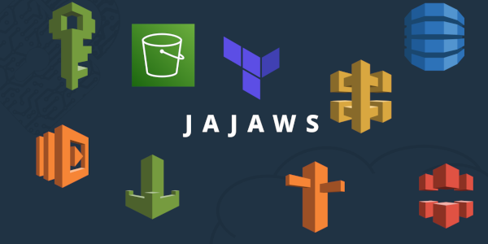

# JAJAWS

JAJAWS aims to provide tips for rapidly deploying an AWS infrastructure with Terraform. I want to combine different aspects like Offensive Security, Cloud or Phishing. The main idea is to provide you tutorials and Terraform module that can give you some infrastructure to respond to a need.

Before getting started, it is recommended to read the 'Recommended Infrastructure' section, which will serve as the foundation for all the sections provided.

Table of Contents
=================

- [Recommended Infrastructure](Installation/README.md#recommended-infrastructure)
  - [Keywords](Installation/README.md#keywords)
    - S3 Bucket
    - CodeBuild
    - CodePipeline
    - CodeCommit
- [Serverless Website](Serverless%20Website/README.md#serverless-website)
  - [Keywords](Serverless%20Website/README.md#keywords)
    - S3 Bucket
    - Cloudfront
    - Route53
    - ACM (AWS Certificate Manager)
- [Serverless API QR Code](Serverless%20API%20QR%20Code/README.md#serverless-api-qr-code)
  - [Keywords](Serverless%20API%20QR%20Code/README.md#keywords)
    - API Gateway
    - API Key
    - QR Code
    - Lambda
    - Layers
    - Swagger