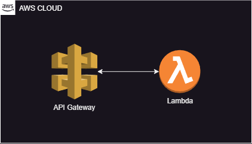
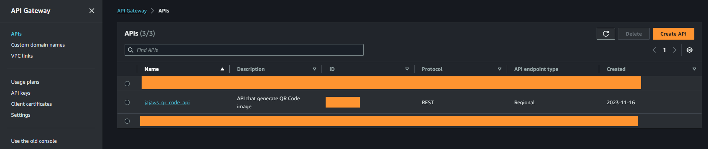
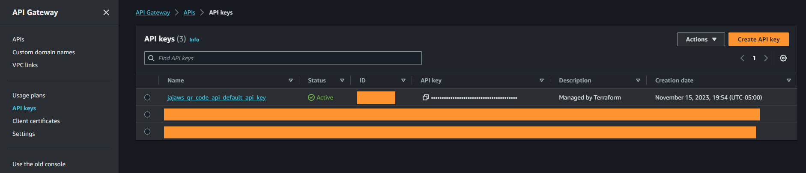
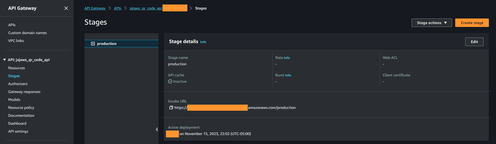

# Serverless API QR Code

Table of Contents
=================

- [Keywords](#keywords)
- [Versions information](#versions-information)
- [Visualization of the Concept](#visualization-of-the-concept)
- [Description of the section](#description-of-the-section)
- [File structure](#file-structure)
- [Swagger API](#swagger-api)
- [Layer](#layer)
- [Lambda code](#lambda-code)
- [Terraform](#terraform)
  - [Variables](#variables)
  - [AWS Data](#aws-data)
  - [Lambda fuction](#lambda-function)
  - [API Gateway](#api-gateway)
- [Declaration and deployment](#layer)
- [Test](#test)
- [Conclusion](#conclusion)

## Keywords

- API Gateway
- API Key
- QR Code
- Lambda
- Layers
- Swagger

## Versions information

| Name          | Version |
|---------------|---------|
| Terraform     | 1.6.4   |
| Hashicorp/AWS | 5.26.0  |

## Visualization of the Concept



## Description of the section

In this section, we will see how to set up an API that generates a QR Code. We will create a module that creates:

- An API Gateway based on a Swagger file
- A Lambda function with a layer

At the end of this section, we should have an endpoint that returns a `base64` image on a POST request.

Before starting, I want to share with you a French article (from a friend of mine) about `QR Code` and phishing: `https://www.cyberformationquebec.ca/2023/11/12/les-codes-qr-pour-dejouer-vos-defenses-antihameconnage/`.

## Files structure

We will not have only Terraform file in this section. Indeed, we need to create a swagger file and codes for our lambda:

- CodeCommit/
  - buildspec.yaml
  - infrastructure/
    - provider.tf
    - qr_code_api.tf
    - zip_output/ ---- OPTIONAL
    - modules/
        - qr_code_api/
            - variables.tf
            - data.tf
            - lambda_layers.tf
            - api_gateway.tf
    - lambda_codes/
        - api_qr_code/
          - jajaws_qr_code/
              - jajaws_qr_code.py
    - layer/
        - jajaws_qr_code_layer.zip
    - api_swagger/
        - qr_code_api/
            - swagger.yaml

Before the Terraform, we are going to prepare all the other file.

## Swagger API

- Working file : `api_swagger/qr_code_api/swagger.yaml`

Long story short, a Swagger file is your API documentation. So basically, we are going to deploy an API based on its documentation. Wihtout documentation, it cannot exist.

In this swagger, we are going to declare an endpoint that can take `OPTIONS` and `POST` request. This endpoint will be protected with an API Key (generated by API Gateway). I’ll just explain a few lines that are interesting for our AWS infrastructure, you can find the file in the `terraform` folder with all the source code.

```yaml
openapi: 3.0.3

info:
  version: '1.0'
  title: "JAJAWS QR Code API"
  description: "API that generate QR Code image"
servers:
  - url: 'https://jajaws.example.com'
components:
  securitySchemes:
    ApiKeyAuth:
      type: apiKey
      in: header
      name: x-api-key
x-amazon-apigateway-request-validators:
  all:
    validateRequestBody: true
    validateRequestParameters: true
x-amazon-apigateway-request-validator: all
```

Here is the first lines of our swagger file. We have the classic lines like `info`, `version`, `url` etc. But after that, we have a few interesting parameters. First, we have `securitySchemes`. These parameters will declare a header for our API key. In this configuration, our API key should be in the `x-api-key` header. Which is a kind of standard for AWS.

To finish, we have a few `x-amazon-apigateway-*` parameters. Those parameters will define how API Gateway will check the request. In our case, we are going to check the body, parameters (in another section). With this, we are sure that the user will submit the right request argument and the right type. We can now define the `POST` request (partial code):

```yaml
paths:
  "/generate_qr_code":
    post:
      tags: ["QRCode"]
      description: "Submit QR Code parameters."
      requestBody:
        required: true
        content:
          application/json:
            schema:
              type: object
              properties:
                text_to_convert:
                  type: string
                  example: Hello World!
              required:
                - text_to_convert
              additionalProperties: false 
      responses:
        '200':
          description: "Gives the QR Code in base64"
          content:
            application/json:
              schema:
                type: object
                properties:
                  error:
                    type: string
                    example: SmVhbi1NaWNoZWwgSmFycmUgLSBPeHlnZW5lLCBQdC4gNA==
      x-amazon-apigateway-integration:
        uri: "${uri_start}jajaws_qr_code${uri_end}"
        httpMethod: "POST"
        type: "aws_proxy"
      x-amazon-apigateway-api-key-source: HEADER
      security:
        - ApiKeyAuth: []
```

Basically, we have the two parts `post` and `responses` that will define the request format and the responses format. In this case we should have a post request with a string of the argument `text_to_convert` and the API should response with a `base64` string. The more interesting part is again `x-amazon-apigateway-*`:

- `x-amazon-apigateway-integration`: Here we will have the Lambda invocation URI. As you can see, we have `${uri_start}` and `${uri_end}` that will be modified by the Terraform depends on the context. So, we just have to put the Lambda name here.
- `x-amazon-apigateway-api-key-source`: With this parameter, we can set the setting for our APIKey and join it with what we set in the first part.

We will see in the Terraform part how to complete this file.

## Layer

- Working folder : `layers/`

A layer gives you the possibility to import external libraries in a Lambda function (we will see this in the next part). In our case we need to import the python library `segno`. I strongly recommend executing the next step on a Linux machine. You can use this script to generate the `zip` file:

```bash
#!/bin/sh

mkdir python
python3 -m pip install segno --no-user -t ./segno_tmp/
cd ./segno_tmp/
mv segno/ segno-*.dist-info/  ../python/
cd ..
rm -r segno_tmp/
zip -r jajaws_qr_code_layer.zip ./python/
rm -r python
```

Now you should have a zip file with:
- python/
    - segno/
    - segno-X.X.X.dist-info

We now have a layer for our lambda that will help us to generate a QR code.

## Lambda code

- Working file : `lambda_codes/api_qr_code/jajaws_qr_code/jajaws_qr_code.py`

⚠️❗ **Important Information** : When I did this section, `segno` was in version `1.5.3`. It is possible that the code needs to be change depends on the new version.

A Lambda function is like a little virtual machine that can execute a code. There are different languages that are supported for Lambda, you can have a list here : `https://docs.aws.amazon.com/lambda/latest/dg/lambda-runtimes.html`. I am going to it in Python, but you can change it if you want to.

To resume, the main idea here is API Gateway will call our Lambda function with the argument. That's why every Lambda should have this function:

```python
import json

def lambda_handler(event, context):
  Do stuff...
```

The `lambda_handler` has two arguments:

- `event`: That contains the information that will be processed by the Lambda (in `JSON` format `https://docs.aws.amazon.com/lambda/latest/dg/services-apigateway.html#apigateway-example-event`).
- `context`: That contains all the information about the invocation of the Lambda.

The second thing is, in this context, we need to return a `JSON`. Remember, this Lambda will return a response after an API call. It is not a standard I think but I like to have this function in my Lambda:

```python
def build_response(code, message):
    return {
        'statusCode': code,
        'body': message,
        'headers': {
            'Content-Type': 'application/json',
            'Access-Control-Allow-Origin': '*' #Adapt this part with your context.
        }
    }
```

Remember, a Lambda function pricing is based on the milliseconds execution (`https://aws.amazon.com/lambda/pricing/`). So with this function I can basically stop my Lambda quickly without having a lot of lines.

Now, we need to get the text that will be submitted by the user in the `POST` request:

```python
def lambda_handler(event, context):
    if event['httpMethod'] == 'POST':
        json_event = json.loads(event['body'])
        if len(json_event["text_to_convert"]) > 100:
            return build_response(400, 'Too long!')
        else:
          ...
```

As you can see, I first check the `httpMethod`. In our case it is not necessary because we don't have any other endpoint that will call this Lambda. I just want to show that it is possible to maybe have a `GET` endpoints that call the same Lambda but execute a different code.

I convert the body in a `JSON` object and check if it's more than 100 characters. Remember, the API Gateway check the type and the body format. 

⚠️❗ **Important Information** : A Lambda function is not destined to calculate big data. In my example, I checked the number of characters because I don’t want a user to ask for a text that is too long. We will see in another section how to manage big data in AWS.

For the `else` part, we will generate the `QR Code` and return the image in `base64`. The little trick here is we will have a read-only Lambda. So we cannot write on the disk, we will need to use a stream for that:

```python
import json, segno, base64
from io import BytesIO

def lambda_handler(event, context):
  if event['httpMethod'] == 'POST':
    if len(json_event["text_to_convert"]) > 100:
      ...
    else:
      qrcode = segno.make(json_event["text_to_convert"], version=5)
      image_stream = BytesIO()
      qrcode.save(image_stream, scale=10, kind='png')
      image_stream.seek(0)
      base64_encoded = base64.b64encode(image_stream.read()).decode('utf-8')
      return build_response(200, base64_encoded)
```

I don't want to take too much time to explain how `segno` works. Basically, we just use the `make()` function to generate the `QR Code` object and save it with `save()` in our `ByteIO()` stream. After that, we just have to read the stream and convert it with `base64`.

We can now return the `base64`.

## Terraform

It is now time to Terraform the infrastructure.

### Variables

- Working file : `variables.tf`

| Name         | Type         | Description                                        |
|--------------|--------------|----------------------------------------------------|
| name_api     | string       | Name for the API.                                  |
| path_swagger | string       | Path to the swagger file.                          |
| path_base    | string       | Path to the folder that contains the lambda codes. |
| endpoints    | list(object) | Lambda mapping with the path_base.                 |

Here is the content of the `variable.tf` file:

```terraform
variable "name_api" {
  description = "Name for the API"
}

variable "path_swagger" {
  description = "Path to the swagger file"
}

variable "path_base" {
  description = "Path to the folder that contains the lambda codes"
}

variable "endpoints" {
    description = "Lambda mapping with the path_base"
    type        = list (
                    object({
                      endpoint_name = string
                      layers        = list(string)
                      timeout       = number
                    }
                  )
                )
}
```

The most interesting variable here is `endpoints`. Basically, we want to loop in a list of Lambda to match with the `path_base`. So we have this structure:

- CodeCommit/
  - buildspec.yaml
  - infrastructure/
    - provider.tf
    - qr_code_api.tf
    - modules/
        - qr_code_api/
            - variables.tf
            - data.tf
            - lambda_layers.tf
            - api_gateway.tf
    - lambda_codes/
        - api_qr_code/
          - jajaws_qr_code/
              - jajaws_qr_code.py
    - layer/
        - jajaws_qr_code_layer.zip
    - api_swagger/
        - qr_code_api/
            - swagger.yaml

The main idea is the `api_qr_code` is the `path_base` that contains all our endpoints. And the `jajaws_qr_code` is one endpoint (one Lambda). With this, you can declare a lot of endpoint just by adding it to a list.

⚠️❗ **Important Information** : The name of your Lambda needs to match with your `swagger.yaml` file.

### AWS Data

- Working file : `data.tf`

For this module, we will need to have a few data that comes from our AWS context. With this solution, you don't have to put sensible information (like your AWS Account ID) in your Terraform. The file is very simple:

```terraform
data "aws_caller_identity" "aws_information" {}

data "aws_region" "aws_region_information" {}
```

- `aws_caller_identity`: Will help us to get the AWS Account ID.
- `aws_region`: Will help us to get the region of your provider.

### Lambda fuction

- Working file : `lambda_layers.tf`

First, we need to set up the permission for our Lambda. First, the basic role for Lambda:

```terraform
resource "aws_iam_role" "iam_for_lambda" {
  for_each            = {for endpoint in var.endpoints: endpoint.endpoint_name => endpoint}
  
  name                = "jajaws_iam_for_lambda_${each.key}"
  assume_role_policy  = <<EOF
{
  "Version": "2012-10-17",
  "Statement": [
    {
      "Action": "sts:AssumeRole",
      "Principal": {
        "Service": "lambda.amazonaws.com"
      },
      "Effect": "Allow",
      "Sid": "JAJAWS_QR_API"
    }
  ]
}
EOF
}
```

As you can see, we have our first loop with `for_each`. Basically, `for_each` will loop through our list of object and create an objects for each loop (each Lambda that we declared). In this case, we will name the role based on the Lambda name. The declaration of the `for_each` loop provides us the possibility to get the `endpoint_name` as a key. We can get this key with `each.key` and put it in the policy name.

Now, we need to give the API Gateway the possibility to invokes our Lambda:

```terraform
resource "aws_lambda_permission" "lambda_permission" {
    for_each      = {for endpoint in var.endpoints: endpoint.endpoint_name => endpoint}

    statement_id  = "AllowExecutionFromAPIGateway"
    action        = "lambda:InvokeFunction"
    function_name = aws_lambda_function.lambda_zip_dir[each.key].function_name
    principal     = "apigateway.amazonaws.com"

    source_arn    = "${aws_api_gateway_rest_api.jajaws_qr_code_api.execution_arn}/*/*"
}
```

Once again, we have the `for_each` loop to give permission to the API Gateway to call all our Lambda. Here is a little explanation:

- `statement_id`: The optional identifier for the policy.
- `action` : What action that we want to authorize.
- `function_name`: The name of our Lambda function.
- `principal`: The service that will use this permission.
- `source_arn`: The ARN of the AWS object that will use this permission. In our case, the API Gateway (that we will see after this part).

Now it's time to declare the Lambda function. With Terraform, there are two steps:

- Zip code.
- Configure the Lambda.

To zip the code, we will use a `data` block:

```terraform
data "archive_file" "lambda_zip_dir" {
    for_each    = {for endpoint in var.endpoints: endpoint.endpoint_name => endpoint}

    type        = "zip"
    output_path = "./zip_output/${each.key}.zip"
    source_dir  = "${var.path_base}${each.key}"
}
```

Through the loop, we will zip the folder that contains our Lambda name and store it into the `zip_output` folder. If you use the [Recommended Infrastructure](../Installation/README.md#recommended-infrastructure), it is not really necessary to have this folder. Because `CodeBuild` will delete its storage after the execution it does not really matter. But, if you execute Terraform on your machine, you don't want to have zip files in your root folder.

After this, we can declare our Lambda function:

```
resource "aws_lambda_function" "lambda_zip_dir" {
    for_each            = {for endpoint in var.endpoints: endpoint.endpoint_name => endpoint}

    filename            = data.archive_file.lambda_zip_dir[each.key].output_path
    source_code_hash    = data.archive_file.lambda_zip_dir[each.key].output_base64sha256
    function_name       = each.key
    handler             = "${each.key}.lambda_handler"
    role                = aws_iam_role.iam_for_lambda[each.key].arn
    timeout             = each.value.timeout
    runtime             = "python3.9"

    layers              = each.value.layers
}
```

Here is a little explanation for each argument:

- `filename`: The name of the zip file. Here, we are going to take the output of our `data` block.
- `source_code_hash`: This one will calculate the hash of our code. If there change, the lambda will be redeploy. If there is no change, Terraform will keep the Lambda without redeploy it.
- `function_name`: The name that we gave.
- `handler`: The name of the main function in our code. If you want to change it, you can but remember that your code needs to have this function.
- `role`: The role that we declare earlier.
- `timeout`: The timeout (in seconds) for our Lambda. Basically, you can control the execution time of your Lambda. If your code takes too much time, the Lambda will stop after this time.
- `runtime`: What language and version we want to use.
- `layers`: The layer that we need for the current lambda.

### API Gatewway

- Working file : `api_gateway.tf`

First, we need to use our `swagger.yaml` file to build the API Gateway. However, if you remember we have variables that needs to be set on this file:

- `uri_start`
- `uri_end`

This can be done with a `data` block:

```terraform
data "template_file" "jajaws_qr_code_api_swagger" {
    template        = "${file("${var.path_swagger}")}"

    vars = {
        uri_start   = "arn:aws:apigateway:${data.aws_region.aws_region_information.name}:lambda:path/2015-03-31/functions/arn:aws:lambda:${data.aws_region.aws_region_information.name}:${data.aws_caller_identity.aws_information.account_id}:function:",
        uri_end     = "/invocations"
    }
}
```

Basically, we need to build the `invocations` ARN to tell to API Gateway which functions needs to be executed for the endpoint. The ARN format is:

`arn:aws:apigateway:REGION:lambda:path/2015-03-31/functions/arn:aws:lambda:REGION:ACCOUNT_ID:function:FUNCTION_NAME/invocations`

Here is a few information:

- `REGION`: We can get it with the `data` in `data.tf`.
- `ACCOUNT_ID`: We can get it with the `data` in `data.tf`.
- `FUNCTION_NAME`: This name should be in the swagger file.

We can now declare the API Gateway based on the `data` block output:

```terraform
resource "aws_api_gateway_rest_api" "jajaws_qr_code_api" {
    name    = var.name_api
    body    = data.template_file.jajaws_qr_code_api_swagger.rendered
    endpoint_configuration {
        types = ["REGIONAL"]
    }
}
```

Very simple here, we want a regional API with a name that we set in our variables based on the swagger. But API Gateway needs other steps to be fully functional. First, the deployment:

```terraform
resource "aws_api_gateway_deployment" "jajaws_qr_code_api_deployment" {
  rest_api_id = aws_api_gateway_rest_api.jajaws_qr_code_api.id

  triggers    = {
    redeployment = sha1(jsonencode(aws_api_gateway_rest_api.jajaws_qr_code_api.body))
  }

  lifecycle {
    create_before_destroy = true
  }
}
```

The API Gateway deployment is a snapshot of our API. It means if we don’t change the code, it will be redeployed (based on the hash like our Lambda function). For the life cycle, I recommend this configuration. Without it, sometimes, you can have an error where the stage cannot be linked to our deployment. With this, we are sure that the deployment is created before.

With the deployment, we need a stage. A stage is the name of the deployment, so you can have for example `production`, `dev` etc. In our case, we will have just a `production` environment. You can add a variable in the module if you think that you will have multiple stages:

```terraform
resource "aws_api_gateway_stage" "jajaws_qr_code_api_stage" {
  deployment_id = aws_api_gateway_deployment.jajaws_qr_code_api_deployment.id
  rest_api_id   = aws_api_gateway_rest_api.jajaws_qr_code_api.id
  stage_name    = "production"
}
```

Very simple here, we just have to link the API Gateway, the deployment and give a name.

There is one piece missing : the API Key. If you remember, in our swagger we protected our endpoint with an API Key. The easiest part is to declare the API Key:

```terraform
resource "aws_api_gateway_api_key" "jajaws_qr_code_api_key" {
  name = "${var.name_api}_default_api_key"
}
```

We just have to give the name and that's it. However, we need to apply an `usage_plan`. That will give us the possibility to associate the API Key to our API and define some limits:

```
resource "aws_api_gateway_usage_plan" "jajaws_qr_code_api_usage_plan" {
  name         = "${var.name_api}-usage-plan"
  description  = "Usage plan ${var.name_api}"

  api_stages {
    api_id = aws_api_gateway_rest_api.jajaws_qr_code_api.id
    stage  = aws_api_gateway_stage.jajaws_qr_code_api_stage.stage_name
  }

  quota_settings {
    limit  = 100
    period = "WEEK"
  }
}
```

Here is a little explanation:

- `name`: Name for the `usage_plan`.
- `description`: Description for the `usage_plan`.
- `api_stages`: The API and the stage where the API Key should work.
- `quota_settings`: The maximum usage for the API Key. You can define an integer and a period of time. The period could be `WEEK` or `MONTH`.

Finally, we can associate the `usage_plan` and our API Key.

```
resource "aws_api_gateway_usage_plan_key" "jajaws_qr_code_api_usage_plan_key" {
  key_id        = aws_api_gateway_api_key.jajaws_qr_code_api_key.id
  key_type      = "API_KEY"
  usage_plan_id = aws_api_gateway_usage_plan.jajaws_qr_code_api_usage_plan.id
}
```

## Declaration and deployment

- Working file : `qr_code_api.tf`

There will be two parts for the declaration. If you follow correctly, there is one part missing : the layer. Because it takes only one block, I didn't want to include it in the module. It could be very difficult to map if you have multiple endpoints. You can declare the following block:

```terraform
resource "aws_lambda_layer_version" "lambda_layer" {
  filename          = "./layers/jajaws_qr_code_layer.zip"
  layer_name        = "jajaws_qr_code_layer"

  source_code_hash  = filebase64sha256("./layers/jajaws_qr_code_layer.zip")
}
```

Very simple here:

- `filename`: The path to the zip file that we did in the [Layer part](#layer).
- `layer_name`: The name for the layer.
- `source_code_hash`: As Lambda and API Gateway, Terraform will redeploy your layer if the code change.

Under this block, we can now declare our module:

```terraform
module "jajaws_qr_code_api" {
    source          = "./modules/qr_code_api"
    name_api        = "jajaws_qr_code_api"
    path_swagger    = "./api_swagger/qr_code_api/swagger.yaml"
    path_base       = "./lambda_codes/api_qr_code/"
    endpoints       = [
                        {
                            endpoint_name = "jajaws_qr_code"
                            timeout = 10
                            layers = [aws_lambda_layer_version.lambda_layer.arn]
                        }
                      ]
}
```

For the endpoints part, you can add multiple endpoints based on this model. If you followed the [Recommended Infrastructure](../Installation/README.md#recommended-infrastructure), you can now just push your code the CodeCommit. If you did not use it, you can deploy your Terraform like this:

```bash
terraform init
terraform plan
terraform apply
```

## Test

Once the Terraform is deployed, go in the AWS console and search `API Gateway` (don't forget to check the region at the top right):



Click on `API Keys` on the left:



You can click to copy your API key.

Now, go back to the list of API Gateway, click on the API Gateway name and `Stages` on the left.



Click to copy your API URL. You are now ready to test your API.

Here is a quick win in bash to test it (in the URL API don't forget the stage `production`):

```bash
curl -X POST -H "x-api-key: API_KEY" -H "content-type: application/json" -d '{"text_to_convert": "Hello world!"}' "https://URL_API/" | base64 --decode > image.png
```

This will give you the `QR Code` with the text "Hello world!" in `image.png`.

## Conclusion

With this part, you should be able to have a serverless API with Lambda function. The API is secure with SSl certificates and an API Key. 