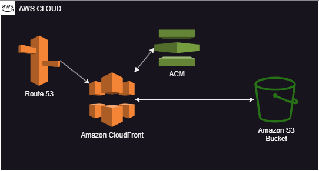
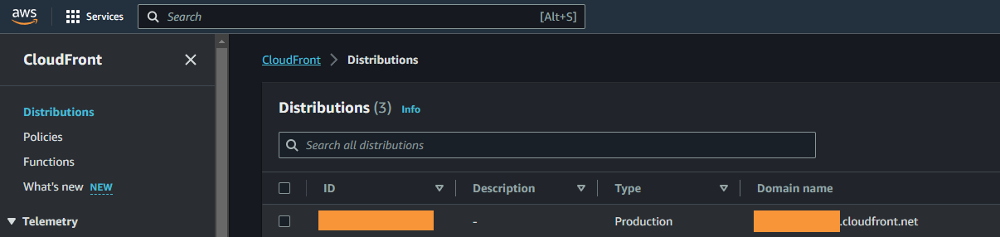
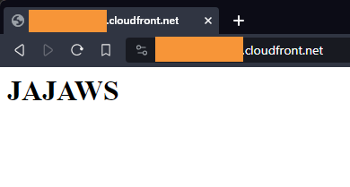

# Serverless Website

Table of Contents
=================

- [Technologies](#technologies)
- [Visualization of the Concept](#visualization-of-the-concept)
- [Description of the section](#description-of-the-section)
- [Module 1 : Basic configuration (S3 + CloudFront)](#module-1--basic-configuration-s3--cloudfront)
  - [Variables](#module-1--variables)
  - [S3 bucket](#module-1--s3-bucket)
  - [CloudFront](#module-1--cloudfront)
    - [CloudFront Distribution](#module-1--cloudfront-distribution)
    - [CloudFront Origin](#module-1--cloudfront-origin)
    - [CloudFront Custom Error Response](#module-1--cloudfront-custom-error-response)
    - [CloudFront Default Cache Behavior](#module-1--cloudfront-default-cache-behavior)
    - [CloudFront Restrictions](#module-1--cloudfront-restrictions)
    - [CloudFront Viewer Certificate](#module-1--cloudfront-viewer-certificate)
  - [Declaration and deployment](#module-1--declaration-and-deployment)
  - [Test](#module-1--test)
- [Module 2  : Adding a Route 53 domain](#module-2--adding-a-route-53-domain)
  - [Variables](#module-2--variables)
  - [S3 bucket](#module-2--s3-bucket)
  - [CloudFront](#module-2--cloudfront)
  - [AWS Certificate Manager (SSL Certificate)](#module-2--aws-certificate-manager-ssl-certificate)
  - [Route 53](#module-2--route-53)
  - [Declaration and deployment](#module-2--declaration-and-deployment)

## Technologies

- S3 Bucket
- Cloudfront
- Route53
- ACM (AWS Certificate Manager)

## Visualization of the Concept



## Description of the section

In this section, we will see how to configure a serverless website. We will create two Terraform modules:
- One with Route 53: If you want to configure your domain name directly in AWS.
- One without Route 53 : If you already have a domain in another provider. You will just need to add a `CNAME` record in your configuration.

We will see in another part how to deploy your code (like ReactJS frontend) in this infrastructure.

## Module 1 : Basic configuration (S3 + CloudFront)

In this part, we will set up a public Bucket S3 and a Cloudfront. This is the simplest infrastructure we will see in this section. We will only use the CloudFront domain with its own SSL certificate (we will see for custom domain after).

For this first module, we will use the following structure for our Terraform (based on what we created in [Recommended Infrastructure](../Installation/README.md#installation)):

- CodeCommit/
  - buildspec.yaml
  - infrastructure/
    - provider.tf
    - basic_serverless_website.tf
  - modules/
    - basic_serverless_website/
      - variables.tf
      - s3.tf
      - cloudfront.tf

Of course, you can use all the naming you want because Terraform don't use the file structure. I used to do it like that but you can change it without any problem.

### Module 1 : Variables

| Name        | Type   | Description             |
|-------------|--------|-------------------------|
| bucket_name | string | Name for the S3 bucket. |

Here is the content of the `variable.tf` file:

```terraform
variable "bucket_name" {
    type = string
    description = "Name for the S3 bucket"
}
```

Very simple, we will just need to have a name for our S3 bucket.

### Module 1 : S3 bucket

- Working file : `s3.tf`

First, we need to create our bucket. For this, go to your `s3.tf` file for example and set up your bucket like this with the variable `bucket_name`:

```terraform
resource "aws_s3_bucket" "jajaws_s3" {
  bucket = var.bucket_name
}
```

With this Terraform, you will have a simple S3 bucket. Now, we are going to put some policy on it. To be more secure, we will block all traffic except from our CloudFront. To do this, we can first block all public access:

```terraform
resource "aws_s3_bucket_public_access_block" "jajaws_s3_public" {
  bucket = aws_s3_bucket.jajaws_s3.id

  block_public_acls = true
  block_public_policy = true
  ignore_public_acls = true
  restrict_public_buckets = true
}
```

With this, it is not possible to access our S3 bucket directly with the S3 public URL `http://BUCKET_NAME.s3-website.REGION.amazonaws.com/`.

Now we want to authorize our CloudFront to reach our bucket. For this, we will create a policy that authorizes a 'CloudFront Identity' to do `GetOject`:

```terraform
data "aws_iam_policy_document" "jajaws_s3_policy_allow_cloudfront" {
    statement {
      principals {
        type = "AWS"
        identifiers = [aws_cloudfront_origin_access_identity.jajaws_cloudfront_s3_oia.iam_arn]
      }
      actions = [
        "s3:GetObject"
      ]
      resources = [
        "${aws_s3_bucket.jajaws_s3.arn}/*"
      ]
    }
}

resource "aws_s3_bucket_policy" "jajaws_s3_policy" {
  bucket = aws_s3_bucket.jajaws_s3.id
  policy = data.aws_iam_policy_document.jajaws_s3_policy_allow_cloudfront.json
}
```

The data block here will create the policy in the right format. After that, we just need to attach it to our bucket S3. We can now, configure our CloudFront.

### Module 1 : CloudFront

- Working file : `cloudfront.tf`

First, we will create the CloudFront identity:

```terraform
resource "aws_cloudfront_origin_access_identity" "jajaws_cloudfront_s3_oia" {
  comment = "Jajaws origin for s3 bucket ${var.bucket_name}"
}
```

The Origin Access Identity (OAI) is a way to authenticate the CloudFront to the S3. With this security, it is not possible to reach your S3 bucket without this identity. Now we can create the CloudFront distribution.

We will also need a `aws_cloudfront_cache_policy` that we will use later:

```terraform
data "aws_cloudfront_cache_policy" "cache-optimized" {
  name = "Managed-CachingOptimized"
}
```

#### Module 1 : CloudFront Distribution

Because this block is big, I will cut it in different parts:

- [Origin](#cloudfront-origin)
- [Custom Error Response](#cloudfront-origin)
- [Default Cache Behavior](#cloudfront-origin)
- [Restrictions](#cloudfront-origin)
- [Viewer Certificate](#cloudfront-origin)

All those parts will be in a main block `aws_cloudfront_distribution`:

```terraform
resource "aws_cloudfront_distribution" "jajaws_s3_distribution" {
  enabled               = true
  is_ipv6_enabled       = true
  default_root_object   = "index.html"
  price_class           = "PriceClass_100"

  origin { See below }

  custom_error_response { See below }

  default_cache_behavior { See below }

  restrictions { See below }

  viewer_certificate { See below }
}
```

There are already four parameters to set here:

- `enabled`: To enable the CloudFront.
- `is_ipv6_enabled`: If you want IPv6.
- `default_root_object`: Most of the time the first file for a website is `index.html`. If you want to change it you can but it will be the first object to be delivered by our CloudFront.
- `price_class`: For the price class you need to choose the best option for you. In my case I'm in Europe so I need  `PriceClass_100`. You can check here for more information : `https://docs.aws.amazon.com/AmazonCloudFront/latest/DeveloperGuide/PriceClass.html`.

#### Module 1 : CloudFront Origin

In the `origin` block, we will define where our website source code is. In our case, the data is in S3:

```terraform
origin {
  domain_name = aws_s3_bucket.jajaws_s3.bucket_regional_domain_name
  origin_id   = "S3-${var.bucket_name}"

  s3_origin_config {
    origin_access_identity = aws_cloudfront_origin_access_identity.jajaws_cloudfront_s3_oia.cloudfront_access_identity_path
  }
}
```

The parameters are set as follows:

- `domain_name`: Our S3 regional domain. As you can see, we just use the output of the `aws_s3_bucket` block.
- `origin_id`: Here you can change it if you want but this ID should be unique.
- `s3_origin_config`: We want to set here the Cloud Front Identity to access our S3 bucket.

#### Module 1 : CloudFront Custom Error Response

Very simple block here, you can choose how to handle HTTP error. I will give an example for 404 error, but you can put multiple blocks like this:

```terraform
custom_error_response {
  error_caching_min_ttl   = 0
  error_code              = 404
  response_code           = 200
  response_page_path      = "/index.html"
}
```

This block simply says: 'For all 404 error, response with 200 code and redirect to the index.html'.

#### Module 1 : CloudFront Default Cache Behavior

In this block, we will set the cache configuration for our CloudFront:

```terraform
default_cache_behavior {
  allowed_methods         = ["GET", "HEAD"]
  cached_methods          = ["GET", "HEAD"]
  target_origin_id        = "S3-${var.bucket_name}"
  cache_policy_id         = data.aws_cloudfront_cache_policy.cache-optimized.id
  viewer_protocol_policy  = "redirect-to-https"
  min_ttl                 = 0
  default_ttl             = 3600
  max_ttl                 = 86400
  compress                = true
}
```

Here is a little explanation for each parameter:

- `allowed_methods`: The HTTP method that we authorize to our S3.
- `cached_methods`: The HTTP method that we want to keep in the cache.
- `target_origin_id`: The origin ID that we want to route.
- `cache_policy_id`: The managed policy that we declared earlier for caching.
- `viewer_protocol_policy`: To specify what protocol the user can use to access to our website (here HTTPS).
- `min_ttl`, `default_ttl` and `max_ttl`: To specify the Time To Live.
- `compress`: To tell CloudFront to compress certain types of files when the browser support it.

#### Module 1 : CloudFront Restrictions

In this block, we can specify some restrictions on our website. I don't want to restrict our website but you can, if you want, restrict to certains countries with this block:

```terraform
restrictions {
  geo_restriction {
    restriction_type = "none"
    /*
    restriction_type = "whitelist"
    locations        = ["GB", "DE"] With "ISO 3166" country code.
    */
  }
}
```

#### Module 1 : CloudFront Viewer Certificate

In this part, we will set the CloudFront certificate. For the moment, we will use the default one. We will see later how to use a custom SSL certificate.

```terraform
viewer_certificate {
  cloudfront_default_certificate  = true
  ssl_support_method              = "sni-only"
  minimum_protocol_version        = "TLSv1.2_2021"
}
```

For the `minimum_protocol_version`, check here for the last version : `https://docs.aws.amazon.com/AmazonCloudFront/latest/DeveloperGuide/secure-connections-supported-viewer-protocols-ciphers.html`.

### Module 1 : Declaration and deployment

- Working file : `basic_serverless_website.tf`

We can now declare the module with the parameters we want:

```terraform
module "jajaws_basic_serverless_website" {
    source = "./modules/basic_serverless_website"
    bucket_name = "jajaws-example"
}
```

You just have the change the `bucket_name` variable and you should be good to deploy. If you followed the [Recommended Infrastructure](../Installation/README.md#recommended-infrastructure), you can now just push your code the CodeCommit. If you did not use it, you can deploy your Terraform like this:

```bash
terraform init
terraform plan
terraform apply
```

The `terraform apply` can take 5-10 minutes because of the CloudFront.

### Module 1 : Test

It is time to test this module. To do it, first we need to create an `index.html` file. For example:

```html
<html>
    <head></head>
    <body>
        <h1>JAJAWS</h1>
    </body>
</html>
```

In the S3 bucket menu on AWS, you should see your S3 bucket (equal to the variable in Terraform). Click on the "Upload" button, "Add files" and select your `index.html` file. You can know lick on "Upload".

In the CloudFront menu on AWS, you should see a distribution and a domain name:



If you go on the domain `https://XXXXXXXXXXXXX.cloudfront.net/`, you should see your `index.html` rendering:



At the end of the first module, you should have a serverless website with CloudFront.

## Module 2 : Adding a Route 53 domain

In this second module, we will see how to add a custom domain with a SSL certificate. All this second module will be based on the "Module 1". We just need to add a few things.

Here is the new structure files :

- CodeCommit/
  - buildspec.yaml
  - infrastructure/
    - provider.tf
    - route53_serverless_website.tf
  - modules/
    - route53_serverless_website/
      - variables.tf
      - s3.tf
      - cloudfront.tf
      - acm.tf
      - route53.tf

### Module 2 : Variables

| Name        | Type   | Description             |
|-------------|--------|-------------------------|
| bucket_name | string | Name for the S3 bucket. |
| domain_name | string | Domain name.            |

Here is the content of the `variable.tf` file:

```terraform
variable "bucket_name" {
    type = string
    description = "Name for the S3 bucket"
}

variable "domain_name" {
    type = string
    description = "Domain name"
}
```

Like the first module, we will need a name for our bucket and the domain we want.

### Module 2 : Bucket S3

- Working file : `s3.tf`

We can simply keep the same file as the first part. For more information check "Module 1 : Bucket S3" in this document.

### Module 2 : CloudFront

- Working file : `cloudfront.tf`

In this file, we will just modify a few arguments. For more information check "Module 1 : CloudFront" in this document.

You normally have this block in your file:

```terraform
resource "aws_cloudfront_distribution" "jajaws_s3_distribution" {
  enabled               = true
  is_ipv6_enabled       = true
  default_root_object   = "index.html"
  price_class           = "PriceClass_100"

  origin { See "Module 1 : CloudFront" }

  custom_error_response { See "Module 1 : CloudFront" }

  default_cache_behavior { See "Module 1 : CloudFront" }

  restrictions { See "Module 1 : CloudFront" }

  viewer_certificate { See "Module 1 : CloudFront" }
}
```

First, we need to add the `aliases` parameter. This parameter can define a custom domain for our CloudFront:

```terraform
resource "aws_cloudfront_distribution" "jajaws_s3_distribution" {
  enabled               = true
  is_ipv6_enabled       = true
  default_root_object   = "index.html"
  price_class           = "PriceClass_100"
  aliases = ["${var.domain_name}"]

  origin { See "Module 1 : CloudFront" }

  custom_error_response { See "Module 1 : CloudFront" }

  default_cache_behavior { See "Module 1 : CloudFront" }

  restrictions { See "Module 1 : CloudFront" }

  viewer_certificate { See "Module 1 : CloudFront" }
}
```

As you can see, we used or `domain_name` variable. Now, we need to modify the `viewer_certificate` to use a custom one:

```terraform
viewer_certificate { 
    acm_certificate_arn       = aws_acm_certificate_validation.jajaws_cert_validation_serverless_website.certificate_arn
    ssl_support_method        = "sni-only"
    minimum_protocol_version  = "TLSv1.2_2021"
}
```

In our case, we will use a certificate that we be generated by ACM (AWS Certificate Manager).

### Module 2 : AWS Certificate Manager (SSL Certificate)

- Working file : `acm.tf`

To validate a certificate we need a domain and the capacity to add a record to it. First, we need to define another provider:

```terraform
provider "aws" {
    alias = "jajaws_acm_provider_serverless_website"
    region = "us-east-1"
}
```

⚠️❗ **Important Information** : You cannot change the region here.

You cannot change the region because we will use the CloudFront region here (that is for the moment `us-east-1`). With this block, we permit Terraform to change the region for our certificate to be with our CloudFront.

We can now create our certificate with a `aws_acm_certificate` block:

```terraform
resource "aws_acm_certificate" "jajaws_ssl_certificate_serverless_website" {
  provider          = aws.jajaws_acm_provider_serverless_website

  domain_name       = var.domain_name
  validation_method = "DNS"

  lifecycle {
    create_before_destroy = true
  }
}
```

Here is an explanation for each parameter:

- `provider`: The provider that we want to use to create our certificate.
- `domain_name`: The domain we want to use.
- `validation_method`: Here we want to validate our certificate with DNS records (we will use Terraform for this as well).

For the DNS validation, we need to create a new record in our domain. For this, we can use a `aws_route53_record` block:

```terraform
resource "aws_route53_record" "jajaws_route53_record_serverless_website_acm" {
    depends_on = [aws_route53_zone.jajaws_route_53_serverless_website]

    for_each = {
        for dvo in aws_acm_certificate.jajaws_ssl_certificate_serverless_website.domain_validation_options : dvo.domain_name => {
            name    = dvo.resource_record_name
            record  = dvo.resource_record_value
            type    = dvo.resource_record_type
        }
    }
    allow_overwrite   = true
    name              = each.value.name
    records           = [each.value.record]
    ttl               = 60
    type              = each.value.type
    zone_id           = aws_route53_zone.jajaws_route_53_serverless_website.zone_id
}
```

To use this block, we need to wait that our domain is available with `depends_on`. We will see later how to declare it in Terraform. In the second part, we can see a `for loop`. This loop will create all the necessary record to validate our certificate.

After, we have some parameters:

- `allow_overwrite`: To erase existing SSL record.
- `name`: The name for the DNS record.
- `records`: The value for the DNS record.
- `ttl`: The Time To Live.
- `type`: The type for the DNS record.
- `zone_id`: Zone ID is the ID for our domain in Route 53.

Finally, we need the `aws_acm_certificate_validation` to complete the validation workflow for our SSL certificate:

```terraform
resource "aws_acm_certificate_validation" "jajaws_cert_validation_serverless_website" {
  provider = aws.jajaws_acm_provider_serverless_website
  
  certificate_arn = aws_acm_certificate.jajaws_ssl_certificate_serverless_website.arn
  validation_record_fqdns = [for record in aws_route53_record.jajaws_route53_record_serverless_website_acm : record.fqdn]
}
```

Mainly, we need to specify:

- `provider`: Once again, to use the CloudFront region.
- `certificate_arn`: To define which certificate we want to validate.
- `validation_record_fqdns`: To define which records will validate our certificate.

We can now declare our domain with Route 53.

### Module 2 : Route 53

- Working file : `route53.tf`

First, we need to set up the Route 53 zone. It will define where our domain will exist in AWS:

```
resource "aws_route53_zone" "jajaws_route_53_serverless_website" {
  name = var.domain_name
}
```

Very simple, we just need to specify our domain name.

To finish, we can specify the `A` record. This `A` record will be our CloudFront domain:

```terraform
resource "aws_route53_record" "jajaws_route53_record_serverless_website" {
  depends_on = [aws_route53_zone.jajaws_route_53_serverless_website]

  zone_id = aws_route53_zone.jajaws_route_53_serverless_website.zone_id
  name = var.domain_name
  type = "A"

  alias {
    name = aws_cloudfront_distribution.jajaws_s3_distribution.domain_name
    zone_id = aws_cloudfront_distribution.jajaws_s3_distribution.hosted_zone_id
    evaluate_target_health = false
  }
}
```

Here too we need to wait for our domain with `depends_on`. After that, we can specify the `zone_id`, the domain name with `name`, the type or record `A` and the alias for our CloudFront.

Note : You can define `evaluate_target_health` to verify if your website is up or not. More information here `https://docs.aws.amazon.com/Route53/latest/DeveloperGuide/resource-record-sets-values.html#rrsets-values-alias-evaluate-target-health`.

### Module 2 : Declaration and deployment

- Working file : `route53_serverless_website.tf`

We can now set up the module with the parameters we want:

```terraform
module "jajaws_route53_serverless_website" {
    source      = "./modules/route53_serverless_website"
    bucket_name = "jajaws-example"
    domain_name = "example.com"
}
```

You just have the change the `bucket_name` and `domain_name` variables and you should be good to deploy. If you followed the [Recommended Infrastructure](../Installation/README.md#recommended-infrastructure), you can now just push your code the CodeCommit. If you did not use it, you can deploy your Terraform like this:

```bash
terraform init
terraform plan
terraform apply
```

⚠️❗ **Important Information** : Because of the DNS validation, this deployment can take times. By experience, it can take up to 30 minutes.